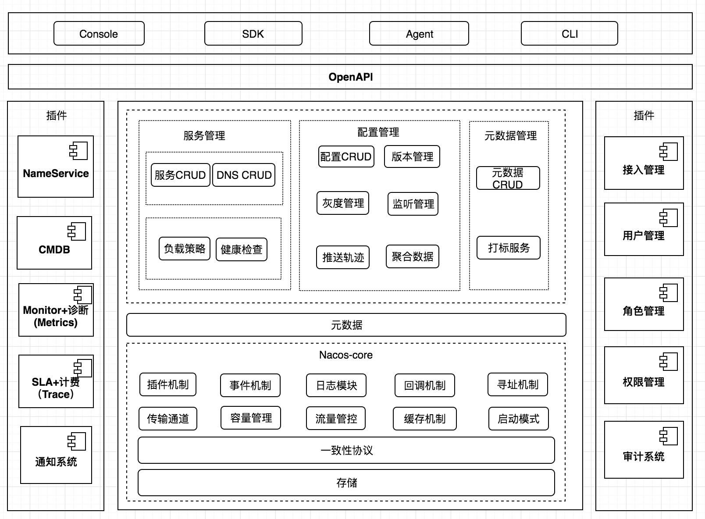
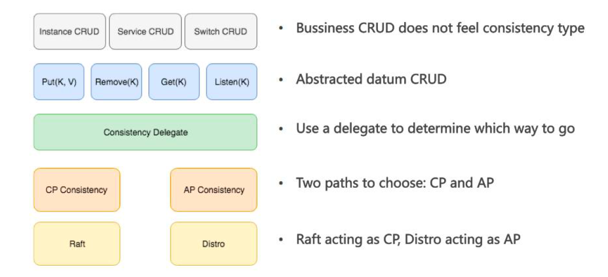

# SpringCloud 原理

## 1. Nacos 架构

**架构**

- 用户
- 核心
- 内核
- 插件

**配置模型**

- 配置
- 配置管理
- 配置服务
- 配置项
- 命名空间
- 配置组
- 配置 ID：`${prefix} - ${spring.profiles.active} - ${file-extension}`
- 配置快照

通过 GRPC 长连接监听配置变更，server 端对比 client 端配置的 md5 和 本地 md5 ，不相等推送配置变更

SDK 会保存快照，服务端出现问题时从本地获取

### 1. Nacos 内核设计

#### 一致性

同时运行 CP 和 AP协议

- 服务注册：最终一致性 (保证高可用，不能罢工)
- 配置管理：强一致性 (不能丢失配置，必须保证一半的节点把配置保存成功)

一致性协议：ConsistencyProtocol

数据存储抽象：KvStorage

#### Distro 协议

保证分布式环境下每个节点上的服务信息状态能及时通知其他节点

AP 保证某些 nacos 节点故障后系统依然可以正常工作

- 每个节点是平等的都可以处理写请求，同时把新数据同步到其他节点
- 每个节点只负责部分数据，定时发送自己负责数据的校验值到其他节点保存数据一致性
- 每个阶段独立处理读请求，及时从本地发出响应

工作原理：

- 数据初始化：轮询所有的 distro 节点，向其他集群发送请求拉取全量数据
- 数据校验：各机器定期发送心跳，心跳信息为本机器上所有数据的元信息；检测到数据不一致发起全量请求
- 写操作：
- 写操作：

#### 通信通道

#### 寻址机制

感知节点变更信息 `MemberLookup` 接口

`ServerMemberManager` 存储本节点知道的所有成员节点列表信息，提供增删改查功能

- 单机寻址 (`StandalineMemberLookup`)：ip:port
- 文件寻址 (`FileConfigMemberLookup`)：每个 nacos 节点维护一个 cluster.conf 的文件，里面写入每个节点的 ip 信息；每次扩容缩容都要修改所有的文件，使用 文件监听器 重写读取文件
- 地址服务器寻址 (`AddressServerMemberLookup`)：只维护一份 cluster.conf，其他节点定时向地址服务器请求最新的节点信息列表

### 2. 服务发现模块

#### 注册中心的设计原理

**数据模型**

四层数据逻辑隔离 (company, namespace, group, service)

- 临时实例：客户端上报 (自动上报心跳，自动移除不健康实例，无需持久化存储 (微服务，dubbo))
- 持久实例：服务端反向探测 (数据库，缓存等)

**数据一致性** 

paxos 协议，renew 机制，**raft 协议 (CP)，distro 协议 (AP)**

- 非对等部署的单点写一致性
- 对等部署的多写一致性

nacos 实现两种协议

- 基于简化 raft 的 CP 一致性
- 基于自研 distro 的 AP 一致性

将与业务相关的CRUD 与底层的⼀致性同步逻辑进行了分层隔离。然后将业务的读写（主要是写，因为读会直接使用业务层的缓存）抽象为Nacos 定义的数据类型，调用⼀致性服务进行数据同步。在决定使用CP 还是AP ⼀致性时，使用⼀个代理，通过可控制的规则进行转发。

**负载均衡**

- 客户端负载均衡：ribbon，现根据策略选择要请求的节点，然后发送请求到具体服务端
- 服务端负载均衡：客户端发送请求到服务端后，服务端根据策略转发到具体节点

基于权重、服务提供者负载、响应时间、标签等策略

ribbon (eureka)：IRule，先过滤掉不会采用的服务提供者实例，然后在剩下的实例中实时负载均衡策略

fabio (consol)：

**健康检查**

心跳上报 (TTL 机制)

- tcp 端口探测
- http 返回码探测

- 客户端健康检查：关注客户端上报心跳的方式、服务端移除异常客户端的机制 (等待心跳，刷新 ttl，可以移除异常实例)
- 服务端健康检查：关注探测客户端的方式、灵敏度、设置客户端健康状态 (根据注册的健康检查方式，执行相应的接口，判断返回结果，做好重试机制 和 线程池管理；如果不自动注销无法移除异常实例)

**性能与容量**

**易用性**

**集群扩展性**

**用户扩展性**

#### 注册中心服务数据模型

**服务 (service) 和服务实例 (instance)**

服务：由应用程序提供的一个或一组软件功能的抽象概念 (一个应用可能提供多个服务)

实例：某个服务具体提供能力的节点 (一个服务可以有多个实例)

定义服务

- 命名空间
- 分支
- 服务名

服务元数据：定义 nacos 中服务的细节属性 和 描述信息

- 健康保护阈值：过多实例故障时，为了防止所有流量流入剩余实例将正常服务压垮形成雪崩；将健康保护阈值定义为 0 - 1 的浮点数，当健康实例占比小于该值是，无论实例是否健康，都会将该实例返回给客户端 (这回损失一些流量)，保证健康实例能正常工作
- 实例选择器：在获取服务下的实例列表时，进行过滤筛选
- 拓展数据：用户用户在注册实例时自定义扩展的元数据内容 (KV)

定义实例

- ip
- port
- 健康状态
- 集群：表示该实例属于那个逻辑集群
- 拓展数据

实例元数据：作用于实例运维相关的数据信息

- 权重
- 上线状态
- 拓展数据

持久化属性

​	一个服务只能被定义成其中一个，定义完成后在生命周期结束之前无法修改

- 非持久化服务 (默认)：spring cloud, dubbo...

- 持久化服务

  

**集群**

定义集群

- 健康检查类型：tcp, http, mysql, none
- 健康检查端口
- 是否使用实例端口进行健康检查
- 扩展数据：可以自定义扩展的元数据内容 (KV)

**生命周期**

服务的生命周期

实例的生命周期

- 持久化实例：维护健康状态，不会自动中止实例的生命周期除非自动注销
- 非持久化实例：通过 grpc 的长链接维持状态

集群的生命周期

元数据的生命周期

#### 健康检查机制

**临时实例的健康检查**

- 通过 nacos 的 OpenAPI 进行服务注册 (调用 http 接口发送心跳)
- 通过 nacos 提供的 SDK 进行服务注册 (通过 grpc 与注册中心保存连接发送心跳)

**永久实例的健康检查**

- 注册中心探测机制：http, tcp, mysql

**集群下的健康检查机制**

一个服务只会被一个 nacos 集群中的注册中心负责，有服务注册时，会将健康信息同步到集群中的其他节点

### 3. 配置管理模块

#### 配置一致性模型

- server 间的一致性

  - 有 DB：数据写入任意一个 server，优先持久化，成功后通知其他节点去数据库拉取最小的配置
  - 无 DB：raft 协议

- sdk 和 server 间的一致性

  判断 md5 是否一致，grpc

### 4. 高可用设计

Nacos SDK 有所需服务和配置缓存，Server 即使全挂，走本地缓存，保证核心业务调用不受影

### 5. 鉴权插件

RBAC：账号，角色，权限

### 6. 认证机制

spring security

jwt token

## 2. Nacos 生态

### 1. Spring

- `@NacosValue`：

  使用 `NacosValueAnnotationBeanPostProcessor` 处理，client 收到数据变更后，会触发 `NacosConfigReceivedEvent` 事件，计算出新的值然后更新

- `@NacosPropertySource`

  `NacosPropertySourcePostProcessor` 处理，在 bean 定义生成后，实例化之前调用；如果类被该注解修饰就生成，

  [参考](https://www.cnblogs.com/newstudent/p/nacos-config_in_spring-boot.html)

### 2. docker & kubernetes
