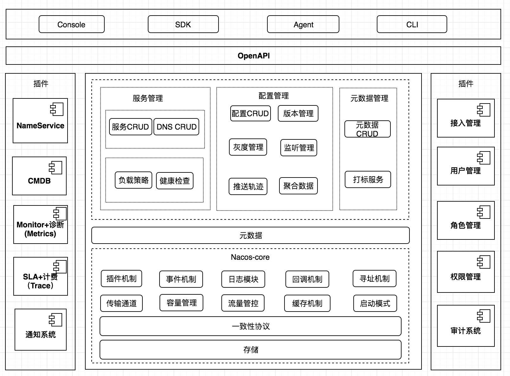

# SpringCloud 原理

## 1. Nacos 架构

**架构**

- 用户
- 核心
- 内核
- 插件

**配置模型**

- 配置
- 配置管理
- 配置服务
- 配置项
- 命名空间
- 配置组
- 配置 ID：`${prefix} - ${spring.profiles.active} - ${file-extension}`
- 配置快照

通过 GRPC 长连接监听配置变更，server 端对比 client 端配置的 md5 和 本地 md5 ，不相等推送配置变更

SDK 会保存快照，服务端出现问题时从本地获取

## 2. Nacos 内核设计

### 一致性

同时运行 CP 和 AP协议

- 服务注册：最终一致性 (保证高可用，不能罢工)
- 配置管理：强一致性 (不能丢失配置，必须保证一半的节点把配置保存成功)

P29

