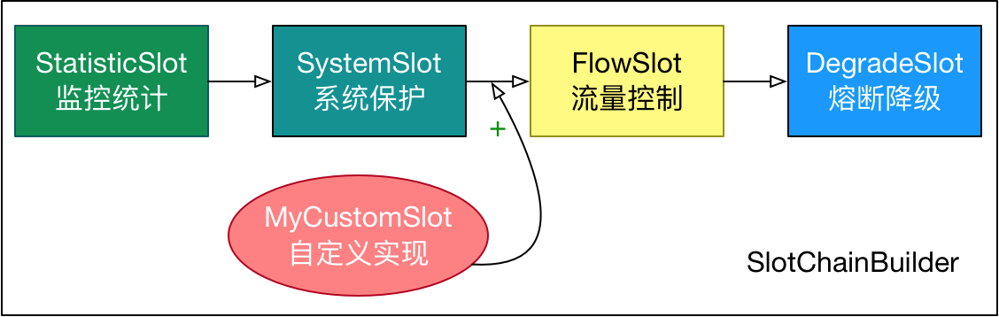

# Sentinel 原理


## 使用

先把可能需要保护的资源定义好（埋点），之后再配置规则

1. 定义资源

   - 主流框架默认适配

   - 抛出异常的方式定义资源

     ```java
     // 1.5.0 版本开始可以利用 try-with-resources 特性（使用有限制）
     // 资源名可使用任意有业务语义的字符串，比如方法名、接口名或其它可唯一标识的字符串。
     try (Entry entry = SphU.entry("resourceName")) {
       // 被保护的业务逻辑
       // do something here...
     } catch (BlockException ex) {
       // 资源访问阻止，被限流或被降级
       // 在此处进行相应的处理操作
     }
     ```

   - 返回布尔值方式定义资源
   - 注解方式定义资源
   - 异步调用支持


2. 定义规则

   - 流量控制规则 (FlowRule)

     |      Field      | 说明                                                         | 默认值                        |
     | :-------------: | :----------------------------------------------------------- | :---------------------------- |
     |    resource     | 资源名，资源名是限流规则的作用对象                           |                               |
     |      count      | 限流阈值                                                     |                               |
     |      grade      | 限流阈值类型，QPS 模式（1）或并发线程数模式（0）             | QPS 模式                      |
     |    limitApp     | 流控针对的调用来源                                           | `default`，代表不区分调用来源 |
     |    strategy     | 调用关系限流策略：直接、链路、关联                           | 根据资源本身（直接）          |
     | controlBehavior | 流控效果（直接拒绝/WarmUp/匀速+排队等待），不支持按调用关系限流 | 直接拒绝                      |
     |   clusterMode   | 是否集群限流                                                 | 否                            |

   - 熔断降级规则 (DegradeRule)

     |       Field        | 说明                                                         | 默认值     |
     | :----------------: | :----------------------------------------------------------- | :--------- |
     |      resource      | 资源名，即规则的作用对象                                     |            |
     |       grade        | 熔断策略，支持慢调用比例/异常比例/异常数策略                 | 慢调用比例 |
     |       count        | 慢调用比例模式下为慢调用临界 RT（超出该值计为慢调用）；异常比例/异常数模式下为对应的阈值 |            |
     |     timeWindow     | 熔断时长，单位为 s                                           |            |
     |  minRequestAmount  | 熔断触发的最小请求数，请求数小于该值时即使异常比率超出阈值也不会熔断（1.7.0 引入） | 5          |
     |   statIntervalMs   | 统计时长（单位为 ms），如 60*1000 代表分钟级（1.8.0 引入）   | 1000 ms    |
     | slowRatioThreshold | 慢调用比例阈值，仅慢调用比例模式有效（1.8.0 引入）           |            |

   - 系统保护规则 (SystemRule)：系统自适应限流从整体维度对应用入口流量进行控制；通过自适应的流控策略，让系统的入口流量和系统的负载达到一个平衡，让系统尽可能跑在最大吞吐量的同时保证系统整体的稳定性

     |       Field       | 说明                                   | 默认值      |
     | :---------------: | :------------------------------------- | :---------- |
     | highestSystemLoad | `load1` 触发值，用于触发自适应控制阶段 | -1 (不生效) |
     |       avgRt       | 所有入口流量的平均响应时间             | -1 (不生效) |
     |     maxThread     | 入口流量的最大并发数                   | -1 (不生效) |
     |        qps        | 所有入口资源的 QPS                     | -1 (不生效) |
     |  highestCpuUsage  | 当前系统的 CPU 使用率（0.0-1.0）       | -1 (不生效) |

   - 来源访问控制规则 (AuthorityRule)：通过黑名单 或 白名单 限制资源是否通过

     通过实现 `RequestoriginParser` 接口获取请求来源，需要使用过滤器添加 (可以禁止通过浏览器直接访问(绕过网关)的请求)

     

     ```yaml
     spring:
       cloud:
         gateway:
           default-filters:
             - AddRrequestHeader=origin,gateway
     ```

     ```java
     @Component
     public class HeaderOrigin implements RequestOriginParser {
     
         @Override
         public String parseOrigin(HttpServletRequest request) {
             String origin = request.getHeader("origin");
             if (origin == null) {
                 return "blank";
             }
             return origin;
         }
     }
     ```

     

   - 热点参数规则 (ParamFlowRule)

     根据参数值统计，对 read 这个资源的第 0 个参数做统计，每 1 秒相同参数值不能超过 5

     如果第 0 个参数值为 4，阈值为 10

     如果第 0 个参数值为 6，阈值为 20

     

     对 springMVC 资源无效，必须使用 `@SentinelResource` 定义，因为 controller 默认添加的资源没有将方法参数放进去，使用注解的资源使用 aop 能拿到方法参数

3. 检验规则是否生效

   流控降级相关的异常都是异常类 `BlockException` 的子类

   ```java
   BlockException.isBlockException(Throwable t);
   ```


**流控模式**

- 直接：统计当前资源的请求，触发阈值时对当前资源直接限流 (clusterNode)

- 关联：统计与当前资源相关的另一个资源，触发阈值时，对当前资源限流 (clusterNode)

  当修改订单业务触发阈值时，对查询业务进行限流

  当 write 触发阈值时，对 read 功能限流，避免 write 功能受到影响 (write 更重要，优先级高)

  

- 链路：统计从指定链路访问当前资源的请求，触发阈值时，对指定链路进行限流 (defaultNode)


**流控效果**

- 快速失败：达到阈值后，新请求立刻拒绝并抛出 FlowException 异常
- warm up：预热模式，超出阈值后抛出异常，阈值是变化的，逐渐增大
- 排队等待：所有请求按照请求顺序排队依次执行，两个请求的间隔不能小于指定时长，超过最长等待时间的请求直接拒绝


**隔离 和 降级**

对服务调用者的保护

- feign + sentinel

  - feign.sentinel.enable=true
  - 实现 FallbackFactory 并注册为 bean
  - 在 @FeignClient 中配置

- 线程隔离

  - 线程池 (hystrix)：支持主动超时、异步调用；线程的额外开销较大；低扇出

  - 信号量 (sentinel)：轻量级；高扇出 (网关)

    舱壁模式，控制线程数

    

- 熔断降级

  熔断器：closed, open, half-open

  - 慢调用

    

    响应时间大于 500ms 的数据慢调用，最近 10000ms 内如果请求超过 5 并且异常比例大于 0.5，触发熔断，熔断时长 5s，然后进入 half-open 状态，放行一次请求做测试

  - 异常比例

  - 异常数


**统一异常处理**

实现 `BlockExceptionHandler`

| 异常                 | 说明             |
| -------------------- | ---------------- |
| FlowException        | 限流异常         |
| ParamFlowException   | 热点参数限流异常 |
| DegradeException     | 降级异常         |
| AuthrityException    | 授权规则异常     |
| SystemBlockException | 系统规则异常     |


## 核心类


Sentinel 的核心骨架，将不同的 Slot 按照顺序串在一起（责任链模式），从而将不同的功能（限流、降级、系统保护）组合在一起。

- 统计数据构建部分
- 判断部分

系统为每个资源创建一套 SlotChain


### SPI 机制

sentinel 槽链中每个 slot 的执行顺序是固定好的，用 ProcessorSlot 作为 SPI 接口进行扩展


## 工作流程


在 Sentinel 里面，所有的资源都对应一个资源名称（`resourceName`），每次资源调用都会创建一个 `Entry` 对象。Entry 可以通过对主流框架的适配自动创建，也可以通过注解的方式或调用 `SphU` API 显式创建。Entry 创建的时候，同时也会创建一系列功能插槽（slot chain），这些插槽有不同的职责

- `NodeSelectorSlot` 负责收集**资源的路径**，并将这些资源的调用路径，以树状结构存储起来，用于根据调用路径来限流降级；
- `ClusterBuilderSlot` 则用于存储**资源的统计**信息以及**调用者**信息，例如该资源的 RT, QPS, thread count 等等，这些信息将用作为多维度限流，降级的依据；
- `StatisticSlot` 则用于记录、统计不同纬度的 runtime 指标监控信息；
- `FlowSlot` 则用于根据预设的限流规则以及前面 slot 统计的状态，来进行**流量控制**；
- `AuthoritySlot` 则根据配置的黑白名单和调用来源信息，来做黑白名单控制；
- `DegradeSlot` 则通过统计信息以及预设的规则，来做**熔断降级**；
- `SystemSlot` 则通过系统的状态，例如 load1 等，来控制总的入口流量；


node 类型


​	自定义 slot




## 流量控制

**qps / 并发数**

- `resource`：资源名，即限流规则的作用对象
- `count`: 限流阈值
- `grade`: 限流阈值类型（1-QPS 或 0-并发线程数）
- `limitApp`: 流控针对的调用来源，若为 `default` 则不区分调用来源
- `strategy`: 调用关系限流策略
- `controlBehavior`: 流量控制效果（直接拒绝、Warm Up (预热/冷启动)、匀速排队）


**基于调用关系的流量控制**

- 根据调用方限流
- 根据调用链路入口限流：链路限流
- 具有关系的资源流量控制：关联流量控制


## 网关流控

- GatewayFlowRule：网关限流规则
- ApiDefinition：用户自定义的 api 定义分组

网关流控默认的粒度是 route 维度以及自定义 API 分组维度，默认不支持 URL 粒度


**原理**

Sentinel 底层会将网关流控规则转化为热点参数规则（`ParamFlowRule`），存储在 `GatewayRuleManager` 中，与正常的热点参数规则相隔离

GatewayFlowSlot：专门用来做网关规则的检查，从 `GatewayRuleManager` 中提取生成的热点参数规则，根据传入的参数依次进行规则检查


## 熔断降级

- 慢调用比例：熔断、探测恢复、关闭
- 异常比例
- 异常数


熔断器事件监听


## 热点参数限流

统计某个热点数据中访问频次最高的 Top K 数据

```java
// paramA in index 0, paramB in index 1.
// 若需要配置例外项或者使用集群维度流控，则传入的参数只支持基本类型。
SphU.entry(resourceName, EntryType.IN, 1, paramA, paramB);
```

对于 `@SentinelResource` 注解方式定义的资源，若注解作用的方法上有参数，Sentinel 会将它们作为参数传入 `SphU.entry(res, args)`；比如以下的方法里面 `uid` 和 `type` 会分别作为第一个和第二个参数传入 Sentinel API，从而可以用于热点规则判断：

```java
@SentinelResource("myMethod")
public Result doSomething(String uid, int type) {
  // some logic here...
}
```


## 系统自适应限流


## 黑白名单控制

比如我们希望控制对资源 `test` 的访问设置白名单，只有来源为 `appA` 和 `appB` 的请求才可通过，则可以配置如下白名单规则：

```java
AuthorityRule rule = new AuthorityRule();
rule.setResource("test");
rule.setStrategy(RuleConstant.AUTHORITY_WHITE);
rule.setLimitApp("appA,appB");
AuthorityRuleManager.loadRules(Collections.singletonList(rule));
```


## 实时监控

提供对所有资源的实时监控


## 动态规则扩展

- 通过 api 直接修改

  只能放在内存中

  ```java
  // 修改流控规则
  FlowRuleManager.loadRules(List<FlowRule> rules);
  // 修改降级规则
  DegradeRuleManager.loadRules(List<DegradeRule> rules);
  ```

- 通过 DataSource 接口适配不同数据源修改

  通过控制台设置规则后将规则推送到统一的规则中心，客户端实现 ReadableDataSource 接口端监听规则中心实时获取变更

  - 拉：定时轮训 (文件，consul，eureka)

    `FileRefreshableDataSource`

  - 推：注册监听器 (zookeeper，redis，nacos，apollo)

    `NacosDataSource`


## Sentinel 控制台

`-Dcsp.sentinel.app.type=1` 启动参数会将服务标记为 API Gateway


## Entry

声明资源 

- 手动定义：`Entry entry = SphU.entry("resourceName")`

- 注解定义：`@SentinelResource`

  通过 aop 完成：在 `SentinelAutoConfiguration` 中自动注入切面 `SentinelResourceAspect` 完成功能


## context

Context 代表调用链路上下文，贯穿一次调用链路中的所有 `Entry` 资源。

Context 维持着入口节点（`entranceNode`）、本次调用链路的 curNode、调用来源（`origin`）等信息。

Context 名称即为调用链路入口名称。

Context 维持的方式：通过 ThreadLocal 传递，只有在入口 `enter` 的时候生效。由于 Context 是通过 ThreadLocal 传递的，因此对于异步调用链路，线程切换的时候会丢掉 Context，因此需要手动通过 `ContextUtil.runOnContext(context, f)` 来变换 context。


所有的 Controller 都会被作为资源，通过 `SentinelWebInterceptor` 拦截器 (`SentinelWebAutoConfiguration` 注入)，入口是 `sentinel_spring_web_context`

`com.alibaba.csp.sentinel.adapter.spring.webmvc.AbstractSentinelInterceptor#preHandle`


- preHandler 获取资源名称，获取 contextName (默认 sentinel-spring-web-context)，获取 origin

- 获取 Context (`ContextUtil.enter(contextName, origin)`)，没有的话创建

  先创建入口节点 (EntranceNode) 添加到 ROOT，然后创建 context 把 node 放进去

- 标记资源 (Sphu.entry -> ProcessorSlotChain 依次执行) 放入 request

- controller -> service 执行 ProcessorChainSlot

- afterCompletion 获取 request 中的资源，释放掉


Node 之间的关系

- Node：数据统计接口
- StatisticNode：统计节点
- EntranceNode：入口节点，一个 Context 有一个入口节点，统计当前 Context 的总体流量数据
- DefaultNode：默认节点，统计一个资源在当前 Context 中的流量数据
- ClusterNode：集群节点，统计一个资源在所有 Context 中的流量数据，每个资源都有


通过 aop 完成，SentinelResourceAspect

```java
SphU.entry(resourceName, resourceType, entryType, pjp.getArgs());
```

1. 将信息封装成资源对象 `StringResourceWrapper`

2. `CtSph#entryWithPriority`

3. 从 ThreadLocal 中获取 context

   - 如果是 NullContext 说明当前系统中的 Context (请求数量)超过阈值

   - 如果当前线程没有，创建一个放入 ThreadLocal

     用 name (sentinel_default_context) 和 origin (空字符串) 创建 Context

     - 如果缓存 map 的 size 大于最大值 (2000)，放进去一个 NullContext

     - 创建 EntranceNode 放入 map (同时给 ROOT 添加子节点)

     ```java
     Context context = new Context(node, name);
     context.setOrigin(origin);
     ```

4. 查找 `ProcrssorSlotChain` (一个单向链表，默认包含一个节点，有 `first, end` 两个指针)

   - 从缓存 map 中获取当前资源的 ProcessorSlotChain，如果没找到进行创建

     如果 map 的 size 大于最大值 (6000)，直接返回 null

     使用 `SlotChainProvider 和 SlotChainBuilder` 通过 SPI 创建

   如果没找到 (说明 chain 数量超过阈值)，创建一个 CtEntry

5. 创建一个资源操作对象 (entry)，对资源进行操作 (依次执行上面的 chain)

   - `NodeSelectorSlot` ：创建 `DefaultNode` 节点 (也会缓存，先获取后创建)

   - `ClusterBuilderSlot`：创建 `ClusterNode` 节点

   - `StatisticSlot`：先执行其他，最后进行统计 (线程数/qps)

   - `FlowSlot`：获取所有的流控规则，依次应用，通不过就抛出异常 `FlowException`

     获取当前资源名所有的流控规则进行遍历校验，从规则中获取要限定的来源

   - `DegradeSlot`：


### ProcessorSlotChain 执行流程

SphU.entry -> `CtSph#entryWithPriority`

每个资源都有个 ProcessChain，从缓存中获取，没有的话进行创建 (使用 SPI 机制进行加载)

```
com.alibaba.csp.sentinel.slots.nodeselector.NodeSelectorSlot # 构建节点树
com.alibaba.csp.sentinel.slots.clusterbuilder.ClusterBuilderSlot # 创建 ClusterNode
com.alibaba.csp.sentinel.slots.logger.LogSlot
com.alibaba.csp.sentinel.slots.statistic.StatisticSlot # 统计线程数/qps，自己 和 cluserNode 都要增加
com.alibaba.csp.sentinel.slots.block.authority.AuthoritySlot # 判断 origin (在 Interceptor  通过 OriginParser 获取)
com.alibaba.csp.sentinel.slots.system.SystemSlot # 系统保护
com.alibaba.csp.sentinel.slots.block.flow.param.ParamFlowSlot # 热点参数 给每一个参数分别设置令牌桶，每个请求过来之后计算一下应该有的令牌 (当前时间-上次访问时间)/统计时长*每秒令牌数=一段时间内应该生成的令牌数 (不能超过 max)，判断够不够
com.alibaba.csp.sentinel.slots.block.flow.FlowSlot # 限流 2阈值类型+3流控模式+3流控效果
com.alibaba.csp.sentinel.slots.block.degrade.DegradeSlot # 熔断
```

使用 chain 和 context 创建一个 entry

同一个资源只有一个 ClusterNode ，在每个链路中都有 DefaultNode

default, warm up -> 滑动窗口；rate limit 排队等待 (漏桶算法)


## sentinel 与 hystrix 线程隔离的区别

- 线程池隔离 (hystrix)：支持主动超时、异步调用；线程的额外开销大
- 信号量隔离 (sentinel)：轻量级


## 限流算法

- 计数器算法

  - 固定窗口计数器

    将时间划分为多个窗口，窗口时间间隔 (interval)

    每个窗口维护一个计数器，每次请求加 1

    超出阈值的请求被丢弃

  - 滑动窗口计数器

    将一个窗口划分为多个更小的区间，窗口范围从 (currentTime - interval) 之后的那个时区开始

- 令牌桶算法

  以固定速率生成令牌，桶满了之后多余令牌丢弃

  请求到来后申请到令牌后才能被处理，拿不到令牌的需要等或丢弃

- 漏桶算法

  将所有请求全部放到桶中，以固定速率处理


sentinel

- 默认限流：滑动时间窗口
- 排队等待：漏桶
- 热点参数：令牌桶


## Sentinel 基本概念

- 统计数据：统计某个资源的访问数据
- 规则判断：限流规则、降级规则、熔断规则...


ProcessorSlotChain


